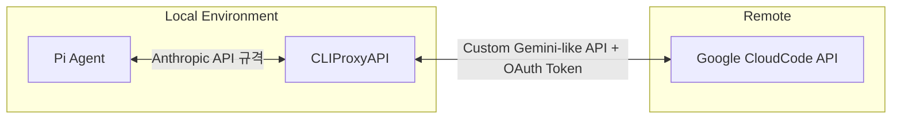

# Google Antigravity Local Proxy Extension 설계도

## 1. 개요 (Background)
Pi 0.71.0 업데이트 이후 공식적으로 지원이 중단된 Google Antigravity(Gemini/Claude 무료 사용 샌드박스) 모델들을 Pi에서 다시 사용하기 위해 고안된 커스텀 확장 프로그램 아키텍처.

구글의 비공식 API(cloudcode-pa.googleapis.com)를 직접 호출하기 위해, 중간에 `CLIProxyAPI`라는 로컬 프록시 서버를 두어 Anthropic API 규격으로 통신을 변환하는 구조를 채택함.

## 2. 아키텍처 (Architecture)

- **Pi Agent**: `pi.registerProvider()`를 통해 `http://127.0.0.1:8317/v1`을 바라보는 커스텀 프로바이더(`google-antigravity`)를 등록.
- **CLIProxyAPI (Local Proxy)**: 백그라운드 포트 8317에서 동작. Pi가 보내는 표준 Anthropic API 요청을 받아 구글 Antigravity 전용 페이로드로 변환 후 전송.
- **Google CloudCode API**: 실제 LLM(Gemini 3 Pro, Claude 3.5 Sonnet 등) 추론 수행.

## 3. 핵심 모듈 구성 (Components)

1. **`index.ts` (Entry Point)**
   - Pi 확장 프로그램의 진입점.
   - `pi.registerProvider()`를 호출하여 가상의 프로바이더와 모델 목록을 Pi Scope에 주입.
   - 구글 OAuth 인증 토큰이 존재할 경우, 백그라운드에서 `CLIProxyAPI` 프로세스를 자동 실행.

2. **`proxy.ts` (Proxy Manager)**
   - Github 릴리즈에서 사용자의 OS/Arch에 맞는 `CLIProxyAPI` 바이너리를 자동 다운로드 및 압축 해제.
   - `config.yaml`을 동적으로 생성하여 포트(8317) 및 인증 디렉토리 매핑.
   - Node.js `spawn`을 이용해 프록시 서버를 백그라운드 디태치(detached) 모드로 구동.

3. **`oauth.ts` (Auth Manager)**
   - 구글 OAuth 2.0 Device/Browser 플로우를 구현.
   - 발급받은 Access Token 및 Refresh Token을 `~/.pi-agy/credentials.json` 및 `CLIProxyAPI`가 인식할 수 있는 경로에 동기화.

4. **`login.ts` (Standalone Auth Script)**
   - 최초 1회 사용자가 직접 실행하여 구글 계정 로그인을 수행하는 독립 스크립트.

5. **`config.ts` (Constants)**
   - 주입할 모델 목록(`AGY_MODELS`) 및 OAuth Client ID/Secret 등 하드코딩된 상수 관리.

## 4. 실패 원인 및 한계 (Post-mortem)
- **구글의 서드파티 클라이언트 차단**: `CLIProxyAPI`를 통한 비정상적인 API 접근이 구글의 어뷰징 탐지 시스템에 적발됨.
- **결과**: `403 PERMISSION_DENIED` 에러와 함께 "Terms of Service 위반으로 서비스 비활성화" 조치(계정 밴)가 내려짐.
- **결론**: 기술적인 구현(프록시 구동, 모델 주입, API 규격 변환)은 완벽하게 동작했으나, 외부 API 제공자(Google)의 정책적 차단으로 인해 프로덕션 레벨에서의 사용은 불가능한 것으로 판명되어 폐기함.